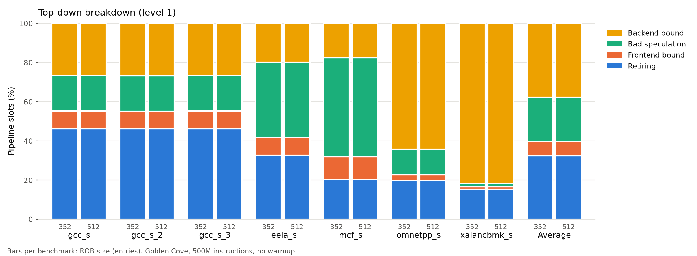
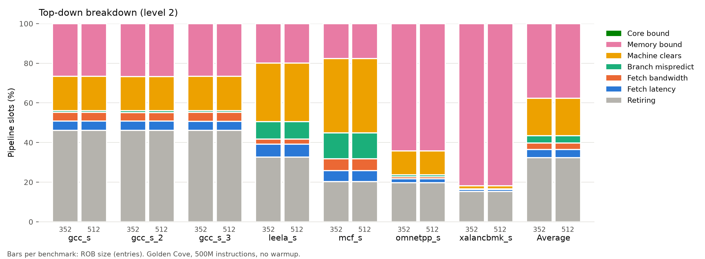
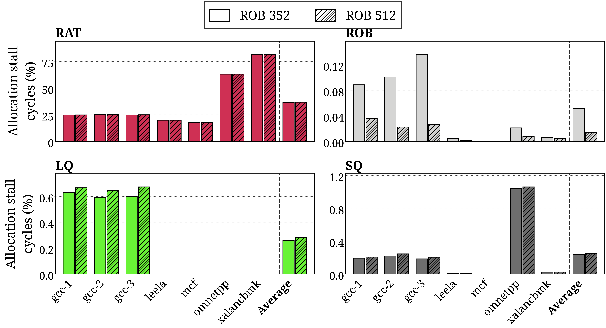
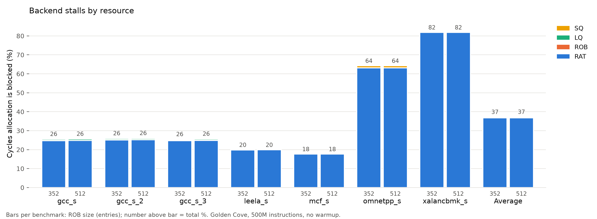
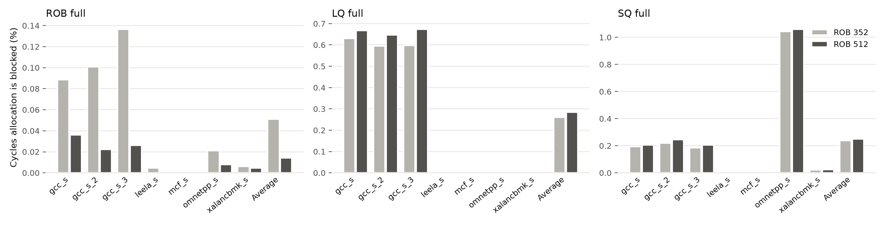

# HPCA 2027 revision: Golden Cove baseline, ROB 352 vs 512

## Setup

| | |
|---|---|
| Core | Golden Cove (`src/PARAMS.golden_cove`) |
| ROB 512 | Golden Cove as-is (`--node_table_size 512`) |
| ROB 352 | Golden Cove with `--node_table_size 352`; nothing else changed |
| Workloads | SPEC CPU2017 speed_int, Helios fixed-region traces ([dataset](https://huggingface.co/datasets/harry1332/helios-spec2017-fixed-region-20261002)) |
| Window | 500M instructions from instruction 1, no warmup (Helios methodology) |
| Scarab branch | `hpca2027-revision-baseline` |
| Launcher | scarab-infra `hpca2027-revision`: `json/hpca2027-revision/baseline.sh` |

## IPC

| Benchmark | ROB 352 | ROB 512 | ROB 512 speedup |
|---|---:|---:|---:|
| gcc_s | 2.024 | 2.023 | -0.02% |
| gcc_s_2 | 2.024 | 2.024 | +0.01% |
| gcc_s_3 | 2.023 | 2.024 | +0.01% |
| leela_s | 1.569 | 1.569 | +0.00% |
| mcf_s | 1.006 | 1.006 | +0.01% |
| omnetpp_s | 0.923 | 0.924 | +0.02% |
| xalancbmk_s | 0.749 | 0.749 | +0.01% |
| **Geomean** | **1.370** | **1.370** | **+0.01%** |

IPC = `Cumulative_Instructions / Cumulative_Cycles` from `core.stat.0.csv`.
Machine-readable copy: [`ipc.csv`](ipc.csv).

## Top-down





Percentages are Scarab's `TOPDOWN_*_BOUND` counters (`core.stat.0.csv`); all
values are in [`topdown/topdown.csv`](topdown/topdown.csv).

## Backend stalls by resource

Paper style (same canvas and colors as `hpca2027-characterization/plot_backend_resource_stalls.py`;
ROB 352 solid, ROB 512 hatched):


One panel per resource, each on its own scale:





ROB, LQ and SQ are below ~1% of cycles, so they are zoomed here:



% of cycles rename/allocation is blocked, by the full backend resource:
RAT (`MAP_STAGE_STALL_ITSELF`: no free physical register to rename into),
ROB / LQ / SQ (`MAP_STAGE_STALLED` split by `FULL_WINDOW_STALL`,
`LSQ_FULL_LOAD_QUEUE`, `LSQ_FULL_STORE_QUEUE`). Scarab never blocks
allocation on a full issue queue, so there is no IQ component. Values: [`backend_stalls/backend_stalls.csv`](backend_stalls/backend_stalls.csv).

## Retirement blocked by a load at the ROB head


% of cycles retirement is blocked because the op at the ROB head is a load
that missed the L1D (`RET_BLOCKED_DC_MISS`; Scarab sets `dcmiss` only for
loads), split into loads served by L2/LLC (`RET_BLOCKED_L1_ACCESS`; Scarab's
"L1" is the LLC) and by DRAM (the rest). Loads at the head that hit in L1D
are not counted. Values: [`rob_head/rob-head-load-retire-stalls.csv`](rob_head/rob-head-load-retire-stalls.csv).

## Layout

```
rob-352/<benchmark>/   Scarab stats (*.stat.0.csv), PARAMS.out, sim.log
rob-512/<benchmark>/   same, for ROB 512
topdown/               top-down figures (PNG + PDF) and topdown.csv
backend_stalls/        backend stall-by-resource figures (PNG + PDF) and CSV
rob_head/              retire stalls with a load at the ROB head (PNG + PDF + CSV)
ipc.csv
```

## Reproduce

```bash
cd ~/scarab-infra && git checkout hpca2027-revision
./json/hpca2027-revision/baseline.sh            # register traces + run
./json/hpca2027-revision/baseline.sh --status
./json/hpca2027-revision/baseline.sh --package  # regenerate this directory
```
